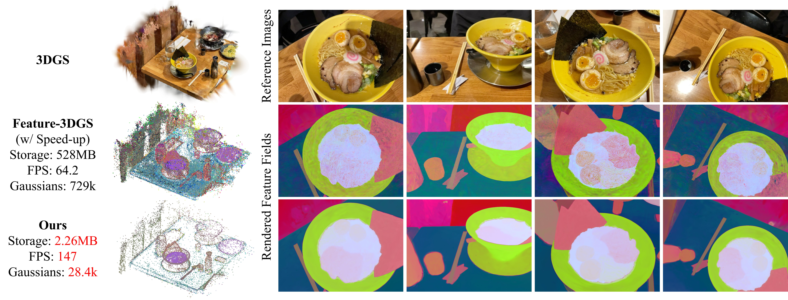

# CF3: Compact and Fast 3D Feature Fields
<h3>ICCV 2025 (Main Conference & Demonstrations Track) </h3>

### [Project Page](https://jjoonii.github.io/cf3-website/) | [Paper](https://arxiv.org/abs/2508.05254)

<p align="center">

</p>

<h3> TL;DR: We propose a method to build compact and fast 3D Gaussian feature fields by effectively compressing and sparsifying Gaussians, achieving competitive performance with significantly fewer gaussians. </h3>


# Environment setup
Our default, provided install method is based on Conda package and environment management:

```shell
conda create --name cf3 python=3.9
conda activate cf3
```
PyTorch (Please check your CUDA version, we used 12.4)
```shell
pip install torch==2.4.0 torchvision==0.19.0 torchaudio==2.4.0 --index-url https://download.pytorch.org/whl/cu124
```

Required packages
```shell
pip install -r requirements.txt
```

Submodules

```shell
pip install submodules/diff-gaussian-rasterization-feature # Rasterizer for RGB, n-dim feature, depth
pip install submodules/diff-gaussian-rasterization # vanilla rasterizer
pip install submodules/simple-knn
```

# Dataset
We organize the datasets as follows:

```shell
├── dataset
│   ├──Pre-trained 3DGS
│   ├──images
│       ├──frame_0000
│          ...
│   ├──sparse/0
│      ...
│   ├──{foundation_model}_features (ex. langsplat_features, lseg_features)
│       ├──frame_0000_fmap_CxHxW.pt
│          ...
    
```
Please refer to [LangSplat](https://github.com/minghanqin/LangSplat) for SAM + CLIP feature maps, and to [Feature 3DGS](https://github.com/ShijieZhou-UCLA/feature-3dgs/tree/main) for LSeg and SAM feature maps.
In addition, any feature map from a desired foundation model can be used, as long as it is stored in the C×H×W format.

## SAM+CLIP feature convert
```
python langsplat_feature_convert.py\
    /dataset/language_features \
    /dataset/langsplat_features \
    3  #We use SAM level 3 for all experiments

```

# Training, Rendering, and Inference: 

## (Optional) When you only need Feature Lifting on pretrained 3DGS
```
python fast_lifting.py -m "${GS_PATH}" -f {foundation_model}\
  --output "${OUTPUT_PATH}" \
  --antialiasing
```

<details>
<summary><span style="font-weight: bold;">Command Line Arguments for fast_lifting.py</span></summary>
  
  #### --source_path / -s
  Path to the source directory containing a COLMAP or Synthetic NeRF data set.
  #### --model_path / -m 
  Path to the pretrained 3DGS model
  #### --foundation_model / -f
  Foundation model encoders, for example `lseg` for LSeg
  #### --images / -i
  Alternative subdirectory for COLMAP images (```images``` by default).
  #### --output / -o
  Path where the output feature lifted 3DGS model is stored (model path by default).
  #### --eval
  Add this flag to use a MipNeRF360-style training/test split for evaluation.
  #### --antialiasing
  Add this flag to use mip filter for antialiasing.
  #### --debug
  Enables debug mode if you experience erros. If the rasterizer fails, a ```dump``` file is created that you may forward to us in an issue so we can take a look.

</details>


## CF3 Training
```
python compact_feature_field.py \
  -m "${PATH_TO_3DGS}" \
  -f "${FOUNDATION_MODEL}" \
  -o "${OUTPUT_PATH}" \
```

The compact feature field would be saved as "{OUTPUT_PATH}/point_cloud/iteration_33000/feature_field.ply".


<details>
<summary><span style="font-weight: bold;">Command Line Arguments for compact_feature_field.py</span></summary>
  
  #### --model_path / -m 
  Path to the pretrained 3DGS model (feature-lifted 3DGS can be also used)
  #### --foundation_model / -f
  Foundation model encoders, for example `lseg` for LSeg
  <!-- #### --source_path / -s
  Path to the source directory containing a COLMAP or Synthetic NeRF data set. -->
  <!-- #### --images / -i
  Alternative subdirectory for COLMAP images (```images``` by default). -->
  #### --output / -o
  Path where the output feature lifted 3DGS model is stored (model path by default).
  #### --eval
  Add this flag to use a MipNeRF360-style training/test split for evaluation.
  #### --debug
  Enables debug mode if you experience erros. If the rasterizer fails, a ```dump``` file is created that you may forward to us in an issue so we can take a look.

  # Default settings
  #### --antialiasing
  Add this flag to use mip filter for antialiasing.
  #### --filter_var
  Enables to filter out the features with high variance during training the autoencoder
  #### --merging
  Enables merging gaussians
  #### --pruning
  Enables pruning gaussians based on importance score
  #### --use_render_feature
  Enables to use high resolution rendered feature during adaptive sparsification
  #### --finetune_decoder
  Enables to finetune feature decoder during adaptive sparsification
  #### --normalize_feature
  Add this flag to normalize feature in the adaptive sparsification pipeline.

  # Optional settings
  #### --use_gt_feature
  Enables to use gt feature during adaptive sparsification
  #### --use_render_depth
  Enables to use depth regularization from rendered depth during adaptive sparsification

  #### --iterations
  Iterations for the adaptive sparsification pipeline
  #### --compress_batch_size
  Batch size of training the auto encoder
  #### --compress_epoch
  Epoch of training the auto encoder
  #### --ae_lr
  learning rate of training the auto encoder
  #### --merge_until_iter
  iterations where to stop merging gaussians
  #### --merge_interval
  iterations interval to merge gaussians
  #### --merge_grad_threshold
  gradient threshold for the criterion to choose which gaussians to merge
  #### --lambda_cossim
  coef for cosine similarity loss for auto encoder
  #### --lambda_metric
  coef for metric loss for auto encoder
  #### --lambda_norm
  coef for norm regularization loss during adaptive sparsification pipeline.
  #### --lambda_depth
  coef for depth regularization loss during adaptive sparsification pipeline.
  #### --contrib_threshold
  global contribution threshold for the criterion to choose which gaussians to merge
  #### --alpha_threshold
  opacity (alpha) threshold for the criterion to choose which gaussians to merge
  #### --similarity_threshold
  feature cosine similarity threshold for the criterion to choose which gaussians to merge

</details>

## (optional) vector quantization
```
python vectree/vectree.py \
  --input_path "${OUTPUT_PATH}/point_cloud/iteration_33000" \
  --save_path "${OUTPUT_PATH}/point_cloud/iteration_34000" \
  --vq_ratio ${VQ_RATIO} \
  --codebook_size ${CODEBOOK_SIZE} \
  --sh_degree 0
```

## Gaussian Rasterization for Feature Lifting
You can customize `NUM_SEMANTIC_CHANNELS` in `submodules/diff-gaussian-rasterization-feature/cuda_rasterizer/config.h` for any number of feature dimension that you want: 

- Customize `NUM_SEMANTIC_CHANNELS` in `config.h`.

The `NUM_SEMANTIC_CHANNELS` matches the visual foundation model dimensions.

For example, 512 for LSeg and CLIP, and 384 for DINO.

#### Notice:
Everytime after modifying any CUDA code, make sure to delete `submodules/diff-gaussian-rasterization-feature/build` and compile again: 
<!-- ```
cd submodules/diff-gaussian-rasterization
pip install .
``` -->
```
pip install submodules/diff-gaussian-rasterization-feature
```


## Gaussian Rasterization for Downstream task
In CF3, a 3-dimensional latent feature is stored in place of the RGB color values, allowing the vanilla 3DGS rasterizer`submodules/diff-gaussian-rasterization` to be used directly without modification.
For downstream tasks, these RGB-encoded latent features can simply be decoded back into the full feature dimension using the decoder before being utilized.

## Evaluation
We followed the [Feature 3DGS](https://github.com/ShijieZhou-UCLA/feature-3dgs/tree/main) protocol for the LSeg experiments, and the [LangSplat](https://github.com/minghanqin/LangSplat) protocol for the SAM + CLIP experiments.

## Open-vocabulary 3D Segmentation
```
python 3d_seg.py \
    --cf3_path {OUTPUT_PATH}\
    --text_queries {text queries} 
```
Adjusting the threshold can yield cleaner instance boundaries.

## Citation
```
@inproceedings{Lee_CF3_ICCV_2025,  
Title={CF3: Compact and Fast 3D Feature Fields},  
Author={Hyunjoon Lee and Joonkyu Min and Jaesik Park},  
Booktitle={Proceedings of the Int. Conf. on Computer Vision (ICCV)},  
Year={2025}  
}
```

## Acknowledgement
Our code is based on
[3D Gaussian Splatting](https://repo-sam.inria.fr/fungraph/3d-gaussian-splatting/),
[Feature 3DGS](https://github.com/ShijieZhou-UCLA/feature-3dgs/tree/main),
[LangSplat](https://github.com/minghanqin/LangSplat),
[LightGaussian](https://github.com/VITA-Group/LightGaussian)